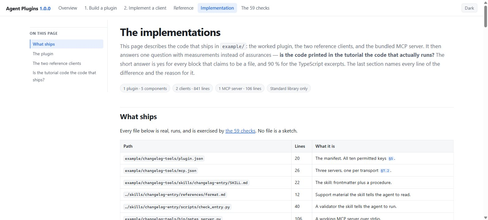
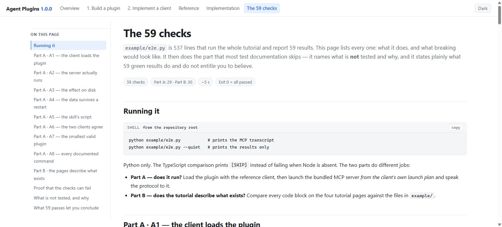

# Agent Plugins 1.0.0 — a complete tutorial

An unofficial, comprehensive tutorial for the
[Agent Plugins Specification 1.0.0](https://github.com/agentplugins/agent-plugins-spec):
how to **build a plugin**, and how to **implement a conformant client**.

Every rule carries its specification section, for example `§7.2.1`, so any claim can be checked
against the canonical text. Where this tutorial and the specification disagree, the specification
governs.

**Read it here: https://az9713.github.io/agent-plugins-spec-tutorial/**

Or read it locally — the pages need no build step and no network:

```bash
git clone https://github.com/az9713/agent-plugins-spec-tutorial
cd agent-plugins-spec-tutorial
python -m http.server 8899        # then open http://127.0.0.1:8899/
```

## The pages

Click any screenshot to open that page.

| | |
| --- | --- |
| [](https://az9713.github.io/agent-plugins-spec-tutorial/) | [](https://az9713.github.io/agent-plugins-spec-tutorial/plugin-authors.html) |
| **[Overview](https://az9713.github.io/agent-plugins-spec-tutorial/)** — what the standard is, the smallest valid plugin, how to run the examples. | **[1 · Build a plugin](https://az9713.github.io/agent-plugins-spec-tutorial/plugin-authors.html)** — every `plugin.json` and `mcp.json` key, inside commented JSON. Ten mistakes that break a plugin. |
| [](https://az9713.github.io/agent-plugins-spec-tutorial/client-implementers.html) | [](https://az9713.github.io/agent-plugins-spec-tutorial/reference.html) |
| **[2 · Implement a client](https://az9713.github.io/agent-plugins-spec-tutorial/client-implementers.html)** — the six-step loading sequence, the failure-boundary ladder, the expansion algorithm, the conformance checklist. | **[Reference](https://az9713.github.io/agent-plugins-spec-tutorial/reference.html)** — field tables, the complete failure matrix, both schemas, the glossary. |
| [](https://az9713.github.io/agent-plugins-spec-tutorial/implementation.html) | [](https://az9713.github.io/agent-plugins-spec-tutorial/e2e-tests.html) |
| **[The implementations](https://az9713.github.io/agent-plugins-spec-tutorial/implementation.html)** — what the example plugin and both reference clients actually contain, and a measured verdict on how faithful the tutorial code is to the shipping files. | **[The 59 checks](https://az9713.github.io/agent-plugins-spec-tutorial/e2e-tests.html)** — every check in `example/e2e.py` explained, what is deliberately untested, and what 59 passes do and do not prove. |

The first four pages teach the specification. The last two document this repository's own code and
its tests, so the tutorial can be checked rather than trusted.

The pages are self-contained: no CDN, no external font, no network request. They follow the
reader's light or dark theme, and carry a manual toggle. The screenshots show the light theme.

## The worked example

`example/changelog-tools/` is one plugin that exercises the whole specification.

```text
changelog-tools/
├── plugin.json                       # all 10 manifest keys           (§5)
├── mcp.json                          # 3 servers, 3 transports        (§7.2)
├── skills/changelog-entry/
│   ├── SKILL.md                      # the skill                      (§7.1)
│   ├── references/format.md
│   └── scripts/check_entry.py
├── bin/notes_server.py               # a working MCP stdio server
└── com.example.client/hooks/         # a client extension directory   (§8.2)
```

Nothing here is a stub. Every file runs:

| File | Lines | What it is |
| --- | --- | --- |
| `plugin.json` | 20 | All 10 manifest keys and nothing else: `$schema`, `name`, `version`, `description`, `author`, `homepage`, `repository`, `license`, `keywords`, `extensions` (§5). |
| `mcp.json` | 26 | Three servers, one per transport: `notes` on `stdio`, `release-api` on `streamable-http`, `legacy-feed` on the deprecated `sse` (§7.2). |
| `bin/notes_server.py` | 106 | A real MCP stdio server. Speaks `initialize`, `tools/list`, `tools/call`. |
| `skills/changelog-entry/SKILL.md` | 22 | The skill: frontmatter plus a procedure (§7.1). |
| `skills/.../references/format.md` | 12 | Support material the skill tells the agent to read. |
| `skills/.../scripts/check_entry.py` | 40 | Validates a changelog entry: exit 0 when the version heading and the section order are right, exit 1 otherwise. Run it with no argument for its own self-check. |
| `com.example.client/hooks/hooks.json` | — | A client extension directory. A client that does not own the reverse-DNS key must ignore it (§8.2). |

The bundled MCP server stores release notes under `${PLUGIN_DATA}`, which demonstrates why that
directory — and not `${PLUGIN_ROOT}` — holds anything that must survive a plugin update.

## The reference clients

Two implementations, same behavior, standard library only. No framework, no runtime dependency.

| Implementation | Lines | Requires |
| --- | --- | --- |
| `example/client/loader.ts` | 484 | Node and TypeScript, compiled under `strict` |
| `example/client/loader.py` | 357 | Python 3 alone |

Each performs the full six-step load: read and validate `plugin.json`, discover skills, read
`mcp.json`, expand `${PLUGIN_ROOT}` and `${PLUGIN_DATA}`, reject any path that escapes its root,
and skip a server whose transport it does not support.

```bash
# TypeScript
cd example/client
npm install
npm test              # the self-check
npm run load-example  # loads ../changelog-tools and prints the launch plan

# Python — no dependency
python loader.py             # the self-check
python loader.py ../changelog-tools
```

### Their tests

Each loader carries its own self-check in the same file, so neither needs a test framework. Run it
with `npm test` or `python loader.py`. A pass prints one line:

```
loader self-check passed
```

Each self-check builds a throwaway plugin in a temporary directory, deliberately fills it with bad
components, and asserts that the good ones still load. The manifest carries an unknown field, which
must be dropped and reported. Of three skill directories, only one is valid: a directory holding a
`README.md` and no `SKILL.md` is not a skill, and a `SKILL.md` nested one level deeper is not
discovered, because the search is not recursive.

The `mcp.json` defines seven servers and exactly two must survive:

| Server | Transport | Outcome |
| --- | --- | --- |
| `ok` | `stdio` | Loads. Its `${PLUGIN_ROOT}` and `${PLUGIN_DATA}` expand in `args`, `env`, and `cwd`. |
| `local_http` | `streamable-http` | Loads — plaintext HTTP is allowed to `localhost`. |
| `escape` | `stdio` | Rejected. The command `../evil` is neither a bare name nor a `./` path. |
| `reserved` | `stdio` | Rejected. It tries to set the reserved variable `PLUGIN_ROOT` (§9.2). |
| `plain_http` | `streamable-http` | Rejected. Plaintext HTTP is allowed to a loopback host only. |
| `legacy` | `sse` | Skipped with a report line. Supporting `sse` is OPTIONAL (§7.2.1). |
| `bogus` | `websocket` | Rejected. Not a transport the specification defines. |

Expansion is asserted to be a **single pass**: `${PLUGIN_ROOT}` expanding to the literal text
`${PLUGIN_DATA}` leaves that text alone rather than expanding it again, and an unknown variable such
as `${OTHER}` is left untouched. A malformed `extensions` value is discarded with a report while the
plugin keeps loading.

Five of the seven servers are bad, two skill directories are not skills, the manifest has a junk
field — and the plugin still comes up with its one real skill and two real servers. That is the whole
point of the specification's failure boundaries: a fault in one component never removes an
independent component.

Expected report line when loading the example:

```
server legacy-feed skipped: transport sse is unsupported
```

That is correct behavior. Support for the deprecated `sse` transport is OPTIONAL (§7.2.1), so the
client skips that one entry and still loads the skill and the two other servers.

## The end-to-end demonstration

`example/e2e.py` is 537 lines that run the whole tutorial and prove it works. Python only; the
TypeScript comparison prints `[SKIP]` instead of failing when Node is absent.

```bash
python example/e2e.py           # prints the MCP transcript
python example/e2e.py --quiet   # prints the results only
```

It reports **59 checks in two parts — 29 in Part A and 30 in Part B** — and takes about five
seconds. The last line is the verdict:

```
=== 59 passed, 0 failed in 5.5s ===
```

Part A loads the plugin with the reference client, launches the bundled MCP server from the client's
own launch plan, runs `initialize` → `tools/list` → `add_note` → `list_notes`, checks that the notes
land under `${PLUGIN_DATA}` and that nothing is written inside `${PLUGIN_ROOT}`, restarts the server
to prove the data survives, runs the skill's validator on a good and a bad changelog, builds and
loads the smallest valid plugin from `index.html`, and confirms both reference clients produce an
identical launch plan.

Part B compares the code on the four HTML pages with the files in `example/`: the annotated
`plugin.json` and `mcp.json` must parse to the real files, the printed name regex must be the regex
both loaders compile, the directory tree must name every file that exists, and the sample loader
output must be the output the loader prints.

Part B scans the four tutorial pages only. `implementation.html` and `e2e-tests.html` are outside it
on purpose, because adding them would change the count that `e2e-tests.html` documents.

Exit code 0 means every check passed. The suite is only worth trusting if it can fail, so that was
tested too: change `${PLUGIN_DATA}` to `${PLUGIN_ROOT}` in `mcp.json` and four checks turn red and
the exit code becomes 1.

Two pages document all of this, and both are live:

- **[The implementations](https://az9713.github.io/agent-plugins-spec-tutorial/implementation.html)**
  — what the plugin and both clients contain, and a measured verdict on tutorial-versus-code
  fidelity: 149 of 165 TypeScript lines shown in the tutorial are verbatim, and every block that
  claims to be a file is identical to that file.
- **[The 59 checks](https://az9713.github.io/agent-plugins-spec-tutorial/e2e-tests.html)** — every
  check named and explained, then the part most test documentation skips: what is **not** tested and
  why, and what 59 green results do and do not entitle you to believe.


## Verify the example plugin end to end

```bash
cd example
printf '%s\n' \
  '{"jsonrpc":"2.0","id":1,"method":"initialize"}' \
  '{"jsonrpc":"2.0","id":2,"method":"tools/call","params":{"name":"add_note","arguments":{"text":"Added magic link login (#412)"}}}' \
  '{"jsonrpc":"2.0","id":3,"method":"tools/call","params":{"name":"list_notes"}}' \
  | NOTES_FILE="$PWD/.plugin-data/changelog-tools/notes.jsonl" \
    python changelog-tools/bin/notes_server.py
```

## Sources

- [Specification 1.0.0](https://github.com/agentplugins/agent-plugins-spec/blob/main/spec/1.0.0.md)
- [Agent Skills specification](https://agentskills.io/specification)
- [Model Context Protocol](https://modelcontextprotocol.io/specification)
- [agent-plugins.org](https://agent-plugins.org/)

## License

Tutorial text and HTML: CC BY 4.0. Example code and reference clients: MIT.
This project is not affiliated with the Agent Plugins project.
