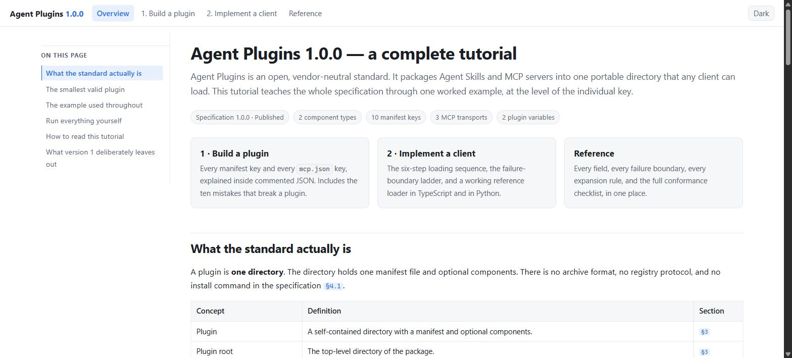
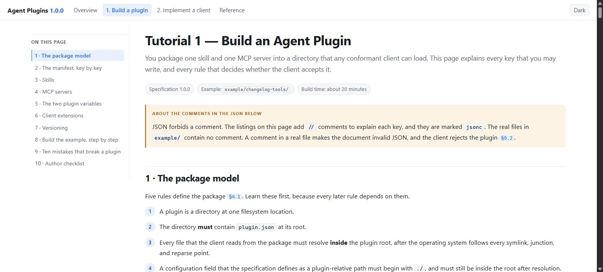
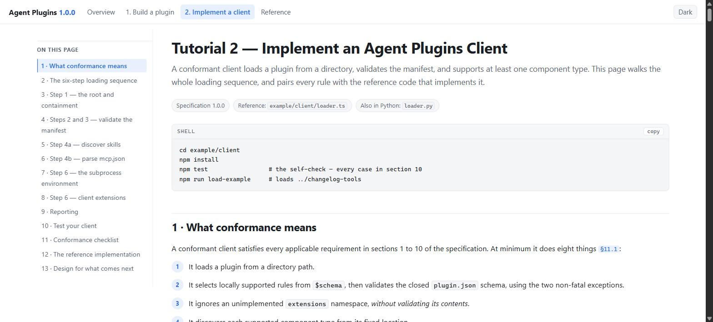
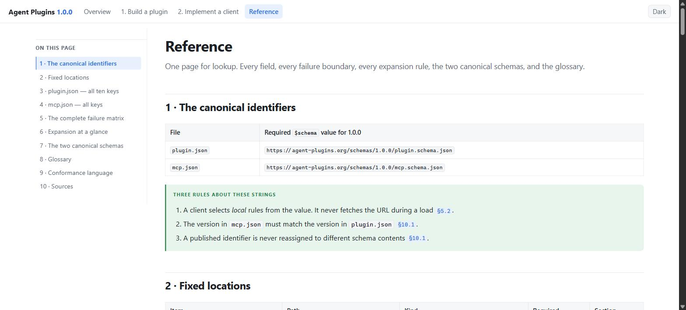

# Agent Plugins 1.0.0 — a complete tutorial

An unofficial, comprehensive tutorial for the
[Agent Plugins Specification 1.0.0](https://github.com/agentplugins/agent-plugins-spec):
how to **build a plugin**, and how to **implement a conformant client**.

Every rule carries its specification section, for example `§7.2.1`, so any claim can be checked
against the canonical text. Where this tutorial and the specification disagree, the specification
governs.

**Read it here: https://az9713.github.io/agent-plugins-spec-tutorial/**

## The pages

Click any screenshot to open that page.

| | |
| --- | --- |
| [](https://az9713.github.io/agent-plugins-spec-tutorial/) | [](https://az9713.github.io/agent-plugins-spec-tutorial/plugin-authors.html) |
| **[Overview](https://az9713.github.io/agent-plugins-spec-tutorial/)** — what the standard is, the smallest valid plugin, how to run the examples. | **[1 · Build a plugin](https://az9713.github.io/agent-plugins-spec-tutorial/plugin-authors.html)** — every `plugin.json` and `mcp.json` key, inside commented JSON. Ten mistakes that break a plugin. |
| [](https://az9713.github.io/agent-plugins-spec-tutorial/client-implementers.html) | [](https://az9713.github.io/agent-plugins-spec-tutorial/reference.html) |
| **[2 · Implement a client](https://az9713.github.io/agent-plugins-spec-tutorial/client-implementers.html)** — the six-step loading sequence, the failure-boundary ladder, the expansion algorithm, the conformance checklist. | **[Reference](https://az9713.github.io/agent-plugins-spec-tutorial/reference.html)** — field tables, the complete failure matrix, both schemas, the glossary. |

The pages are self-contained: no CDN, no external font, no network request. They follow the
reader's light or dark theme, and carry a manual toggle. The screenshots show the light theme.

## The worked example

`example/changelog-tools/` is one plugin that exercises the whole specification.

```text
changelog-tools/
├── plugin.json                       # all 10 manifest keys           (§5)
├── mcp.json                          # 3 servers, 3 transports        (§7.2)
├── skills/changelog-entry/
│   ├── SKILL.md                      # the skill                      (§7.1)
│   ├── references/format.md
│   └── scripts/check_entry.py
├── bin/notes_server.py               # a working MCP stdio server
└── com.example.client/hooks/         # a client extension directory   (§8.2)
```

The bundled MCP server stores release notes under `${PLUGIN_DATA}`, which demonstrates why that
directory — and not `${PLUGIN_ROOT}` — holds anything that must survive a plugin update.

## The reference clients

Two implementations, same behavior, standard library only.

```bash
# TypeScript
cd example/client
npm install
npm test              # the self-check
npm run load-example  # loads ../changelog-tools and prints the launch plan

# Python — no dependency
python loader.py
python loader.py ../changelog-tools
```

Both apply the specification's failure boundaries: a fault in one component never removes an
independent component. The self-check covers the rejection cases, the continue-loading cases, and the
single-pass expansion rule.

Expected report line when loading the example:

```
server legacy-feed skipped: transport sse is unsupported
```

That is correct behavior. Support for the deprecated `sse` transport is OPTIONAL (§7.2.1), so the
client skips that one entry and still loads the skill and the two other servers.

## Verify the example plugin end to end

```bash
cd example
printf '%s\n' \
  '{"jsonrpc":"2.0","id":1,"method":"initialize"}' \
  '{"jsonrpc":"2.0","id":2,"method":"tools/call","params":{"name":"add_note","arguments":{"text":"Added magic link login (#412)"}}}' \
  '{"jsonrpc":"2.0","id":3,"method":"tools/call","params":{"name":"list_notes"}}' \
  | NOTES_FILE="$PWD/.plugin-data/changelog-tools/notes.jsonl" \
    python changelog-tools/bin/notes_server.py
```

## Sources

- [Specification 1.0.0](https://github.com/agentplugins/agent-plugins-spec/blob/main/spec/1.0.0.md)
- [Agent Skills specification](https://agentskills.io/specification)
- [Model Context Protocol](https://modelcontextprotocol.io/specification)
- [agent-plugins.org](https://agent-plugins.org/)

## License

Tutorial text and HTML: CC BY 4.0. Example code and reference clients: MIT.
This project is not affiliated with the Agent Plugins project.
